# Hotel Booking Bot with Amazon Lex

## Table of Contents

- [Overview](#overview)
- [Prerequisites](#prerequisites)
- [Steps](#steps)
- [Additional Notes](#additional-notes)
- [Testing the Chatbot](#testing-the-chatbot)
- [Contributing](#contributing)
- [License](#license)

---

## Overview

This guide demonstrates how to create a hotel booking bot using Amazon Lex. Follow the steps below to set up your bot on the AWS Management Console.

## Prerequisites

Before you begin, ensure you have:

- An AWS account.
- Access to the AWS Management Console.

## Steps

1. Navigate to [AWS Management Console](https://aws.amazon.com/console/).
2. Login to your Amazon Web Services portal.

   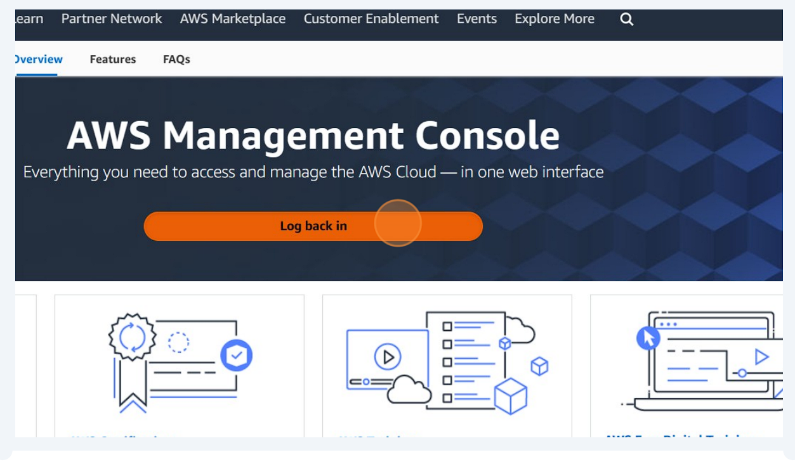

   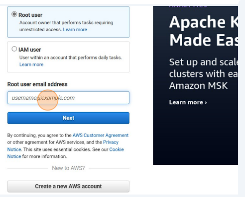

4. Click the "Search" field and type "lex".

   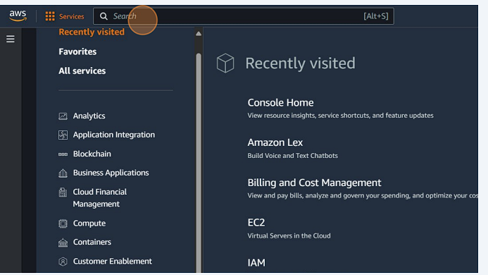
   
5. Click "Amazon Lex".
   
   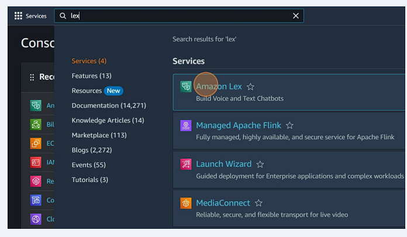

6. Click "Create bot".

   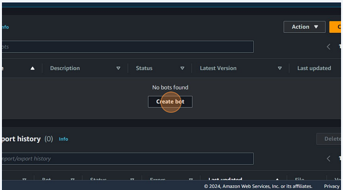

8. Choose "Create a blank bot" or "Create a basic bot".

   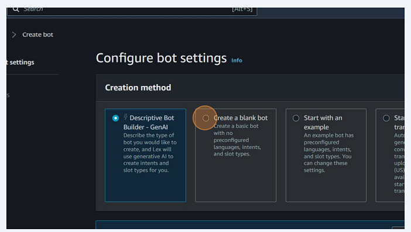

10. Enter the name for your bot in the "Bot name" field. Example: "Hotelbooking".

    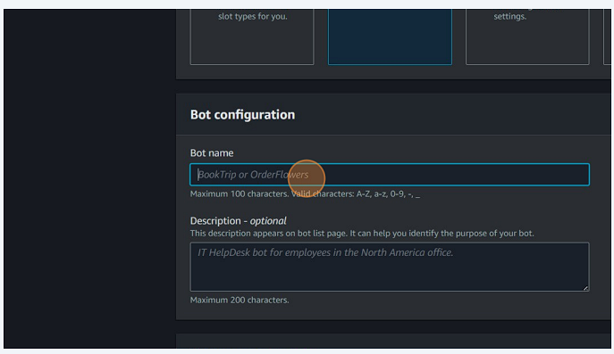

12. Optionally, enter a description for your bot.

    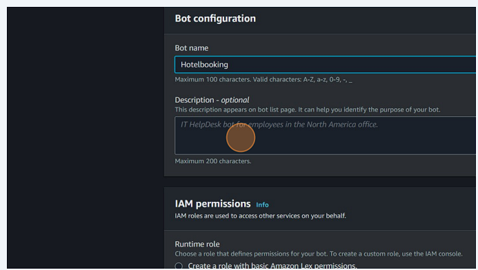

14. Click "No" for the "Childrens Online Privacy  Protection Act (COPPA)"

    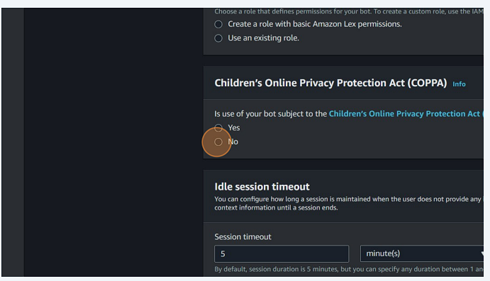

16. select "Create a role with basic Amazon Lex permissions." option.

    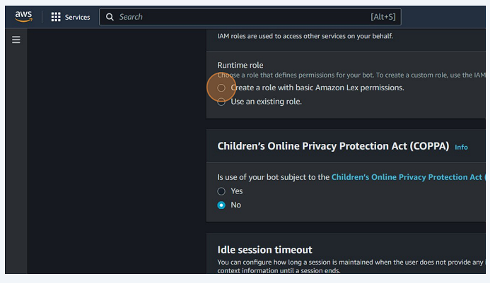
    
18. Click "Next" and then "Done".    

19. Click the "Intent name" field and enter an intent name.

    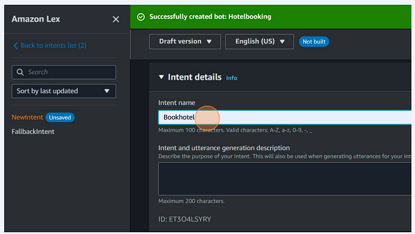
    
21. Click on Initial response and add message

    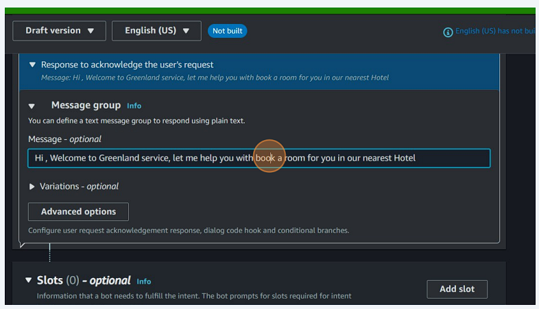

23. Add utterances by clicking "Add utterance" and typing phrases such as "Hi", "I want to book a hotel", "Can you help me to book a room?".

    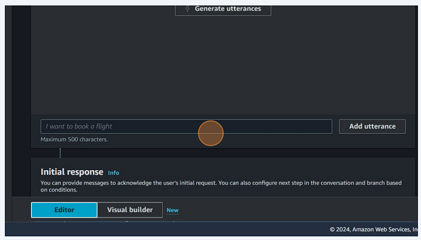

25. For each utterance, add corresponding messages in the "Message - optional" field.

    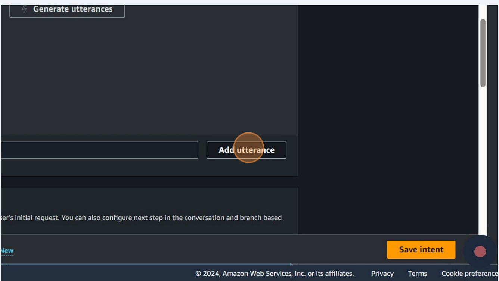

27. Add slots for capturing user inputs, such as first name, last name, check-in date, etc.

    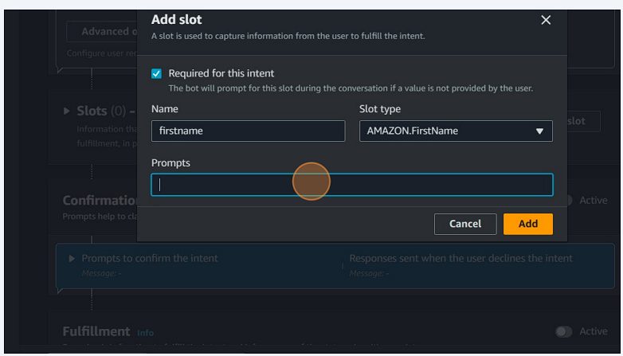

29. Define prompts for each slot to ask the user for input.

30. Configure "In case of failure" and "On successful fulfillment" responses.

    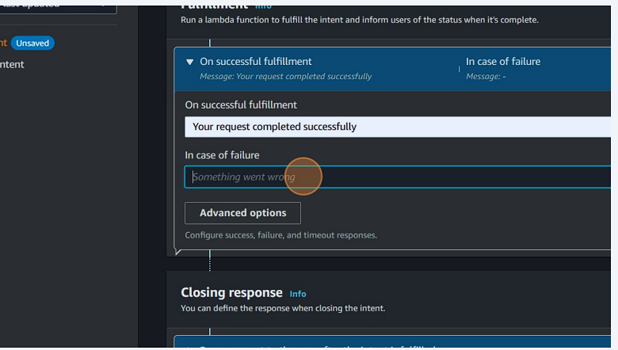

    

32. Add a confirmation prompt and closing response.

    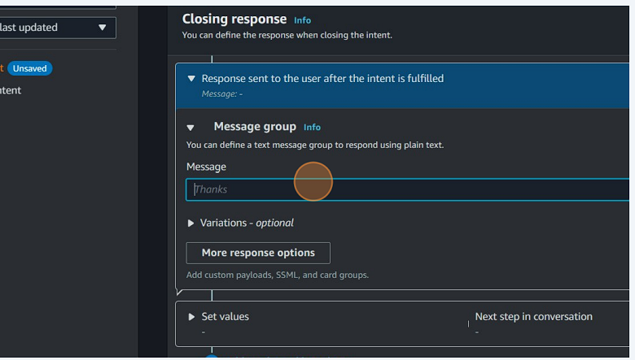

34. Click "Save intent".

    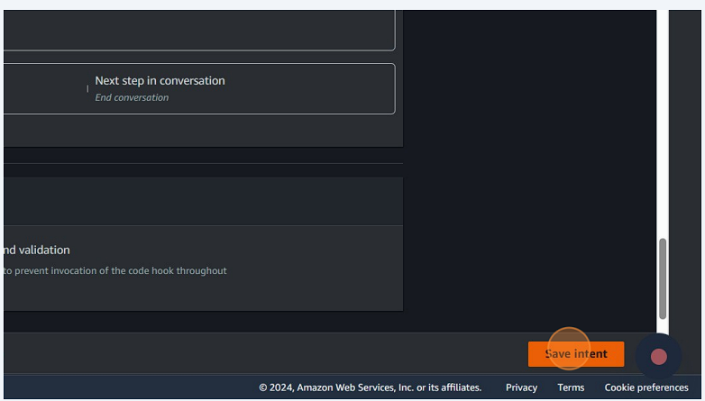

36. Click "Build" and then "Test" to test your bot.

    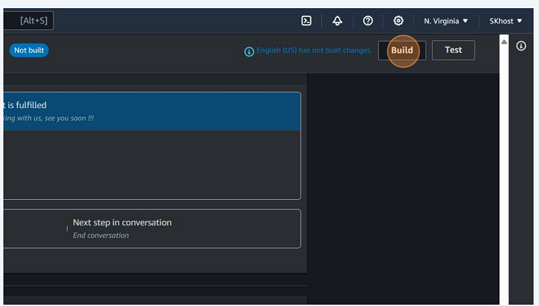

38. Once the bot is ready for complete testing, proceed with testing.

    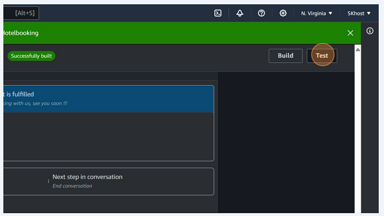

    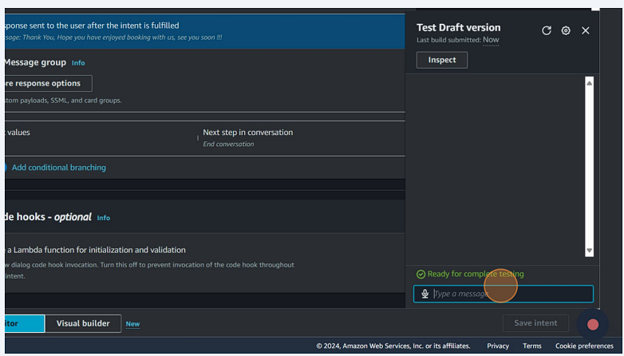

    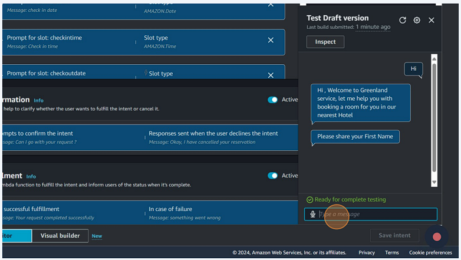

    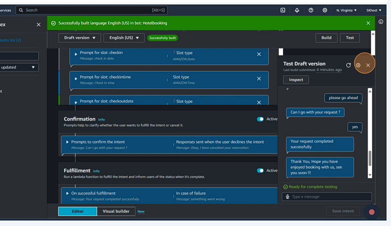

## Additional Notes

For more detailed instructions and troubleshooting tips, refer to the [AWS Lex Documentation](https://docs.aws.amazon.com/lex/).

## Testing the Chatbot

Once your bot is built and configured, it's essential to thoroughly test it to ensure it behaves as expected. Follow these steps to test your chatbot:

1. Initiate a conversation with the bot by typing messages or utterances.
2. Provide inputs for the bot's prompts and slots to simulate user interactions.
3. Verify that the bot responds correctly to different scenarios and inputs.
4. Identify any errors or unexpected behavior and make necessary adjustments to the bot's configuration.
5. Continue testing until the bot performs satisfactorily in various test cases.
6. For detailed PDF version kindly check this [folder](/PDF/HotelBookingBot.pdf)

For more detailed instructions and troubleshooting tips, refer to the [AWS Lex Documentation](https://docs.aws.amazon.com/lex/).

## Contributing

Contributions to this project are welcome! If you find any issues or have suggestions for improvements, please open an issue or submit a pull request on GitHub.

## License

This project is licensed under the MIT License - see the [LICENSE](LICENSE) file for details.
```
